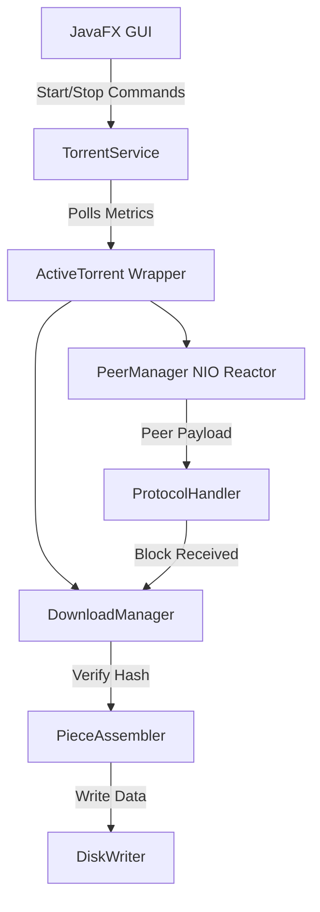

# TorrentX

TorrentX is a modern, high-performance BitTorrent client built entirely from scratch in Java 21. It focuses on thread safety, robust non-blocking networking (NIO), and memory efficiency while providing a clean, responsive desktop interface using JavaFX. 

TorrentX aims to provide a transparent, lightweight alternative to bloated commercial torrent clients while serving as a comprehensive educational reference for implementing complex decentralized networking protocols in modern Java.

## Features & Implementation Status

### 🟢 Implemented (Core Engine)
- **Bencode Parsing:** Defensive, memory-safe decoding with strict path-traversal prevention and recursion depth limits.
- **Tracker Communication:** HTTP tracker announces with robust response parsing and peer list aggregation.
- **NIO Peer Networking:** Non-blocking reactor pattern handling peer discovery, handshakes, and wire protocol state transitions without thread explosions.
- **Piece Management:** Rarest-first piece selection strategy.
- **Disk I/O:** Multi-file and single-file torrent storage writing with asynchronous bounds validation.
- **Data Integrity:** Strict SHA-1 hashing of downloaded pieces.
- **GUI Integration:** Real-time JavaFX dashboard with non-blocking metric polling.

### 🟡 Partially Implemented
- **Upload Engine:** Connection and slot calculation is integrated, but the `ProtocolHandler` currently ignores outgoing `RequestMessage` servicing, meaning the application does not actively seed blocks to leechers yet.
- **Bandwidth Management:** The architecture supports slot limits, but global `DownloadManager` bandwidth throttling (Rate Limiting / Token Bucket) is not yet enforced.
- **Settings Persistence:** `config.properties` loads defaults, but dynamic user-modified states via the JavaFX GUI are not yet persisted back to disk.

### 🔴 Future Work (Not Implemented)
- **DHT (Distributed Hash Table) & Magnet Links**
- **UDP Tracker Protocol**
- **FileChannel Caching / Memory-Mapped I/O** (To optimize disk writes).

---

## Technology Stack

- **Core:** Java 21
- **GUI Framework:** JavaFX
- **Build System:** Apache Maven (3.8+)
- **Testing:** JUnit 5, Mockito
- **Networking:** Java NIO (`Selector`, `SocketChannel`)

---

## Architecture Overview

TorrentX employs a strict separation of concerns, ensuring the UI thread is completely decoupled from the BitTorrent engine.


*(For a deeper dive into component internals, see [ARCHITECTURE.md](ARCHITECTURE.md))*

---

## The BitTorrent Workflow

1. **Add Torrent:** The `.torrent` file is selected via the GUI and parsed into a `TorrentMetadata` object.
2. **Tracker Announce:** `TrackerClient` contacts the HTTP announce URL and receives a swarm of `PeerInfo` IPs and ports.
3. **Peer Handshake:** `PeerManager` initiates non-blocking sockets. Upon connection, the BitTorrent Handshake is exchanged.
4. **Bitfield Exchange:** Peers exchange bitfields, updating `PieceAvailability` maps.
5. **Rarest-First Request:** `DownloadManager` selects the rarest pieces and queues 16KB `RequestMessage` blocks.
6. **SHA-1 Verification:** As blocks arrive via `ProtocolHandler`, they are assembled. Once a piece is full, `PieceAssembler` validates the hash.
7. **Disk Write:** Verified pieces are piped to `DiskWriter` which safely maps the data into the correct multi-file paths.
8. **Seeding (Partial):** Upon completion, the client remains connected, maintaining "Seeding" state.

---

## Installation & Setup

### Requirements
- JDK 21+ installed and active on your system PATH.
- Apache Maven 3.8+ installed.

### Build Instructions
Clone the repository and build the project using Maven:
```bash
git clone https://github.com/yourusername/TorrentX.git
cd TorrentX
mvn clean install
```

### Run Instructions
Launch the JavaFX desktop application directly via Maven:
```bash
mvn javafx:run
```
*(Alternatively, run the packaged shaded `.jar` if configured in the POM).*

---

## Usage Guide

1. **How to add a torrent:** Click the "Add Torrent" button in the toolbar. Select a `.torrent` file from your system, verify the parsed metadata in the dialog, and confirm the target download directory.
2. **How downloading works:** Once added, the torrent is registered with the `TorrentService` and enters the `QUEUED` state. Press "Start" to ignite the `DownloadManager` and `PeerManager` reactor. Progress is updated asynchronously in the GUI.
3. **How uploading & seeding works:** Currently, TorrentX will establish incoming peer connections and transition to a `SEEDING` status upon 100% download completion. Active outbound data serving is queued for future releases.

---

## Configuration

TorrentX reads defaults from `src/main/resources/config.properties`.
You can configure system limits programmatically before engine start:
- `maxConnections`: Limits NIO sockets (default: 50).
- `maxUploadSlots`: Limits actively uploading peers.
- `downloadDirectory`: The default absolute root path for downloaded files.

---

## Security & Reliability

TorrentX treats all network payloads and `.torrent` files as highly untrusted inputs:
- **Bencode Hardening:** Protected against "Billion Laughs" stack overflow attacks with explicit recursion depth limits.
- **Path Traversal:** Rejects malicious `.torrent` multi-file paths attempting to use `.` or `..` or directory separators to escape the download sandbox.
- **Overflow Prevention:** Peer messages utilizing unbounded 32-bit offset/length bounds are strictly guarded against integer overflows before processing.
- **Thread Safety:** The system explicitly avoids "Thread-per-Peer" bottlenecks via the NIO `Selector` pattern.

---

## Testing

The project includes an extensive suite of over 330 unit and integration tests.
```bash
mvn clean test
```

## License

This project is licensed under the MIT License - see the LICENSE file for details.
